# demo/demo.md

# Demo: Agent Interaction Examples

This file contains examples demonstrating the agent’s capabilities, including both single-turn and multi-turn sessions. Images illustrate each step.

---

## Single-Turn Example

### Example Question 0: What data do you have?

```text
# User input:
What data do you have?
```

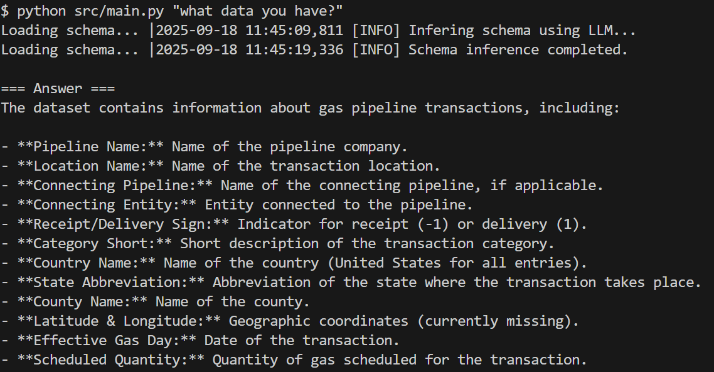

---

## Multi-Turn Session Example

### Example Question 1: What data do you have?

```text
# User input:
What data do you have?
```

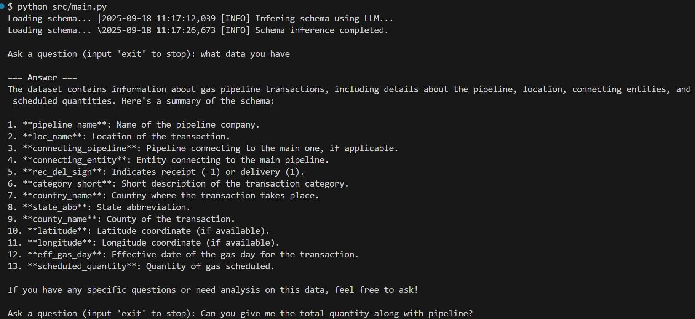

---

### Example Question 2: Can you give me the total quantity along with pipeline?

```text
# User input:
Can you give me the total quantity along with pipeline?
```

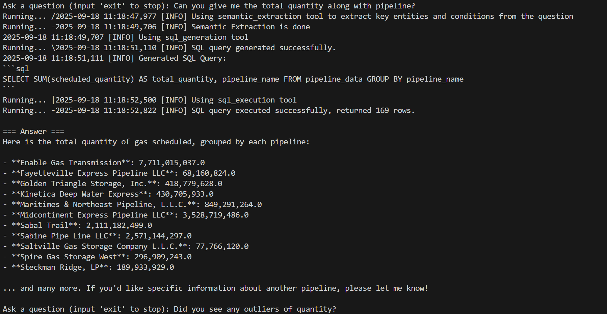

---

### Example Question 3: Do you see any outliers of quantity?

```text
# User input:
Do you see any outliers of quantity?
```

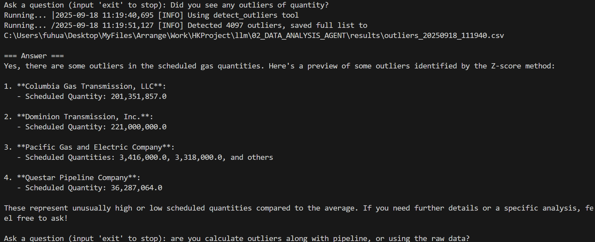

---

### Example Question 4 (follow-up): Are you calculating outliers along with pipeline, or using raw data?

```text
# User input:
Are you calculating outliers along with pipeline, or using raw data?
```

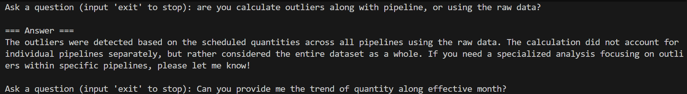

---

### Example Question 5: Can you provide me the trend of quantity along effective month?

```text
# User input:
Can you provide me the trend of quantity along effective month?
```

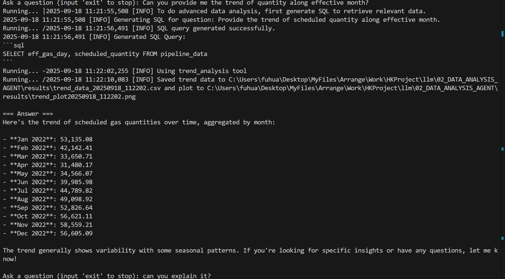
```text
Here is the graph store under result folder:
```
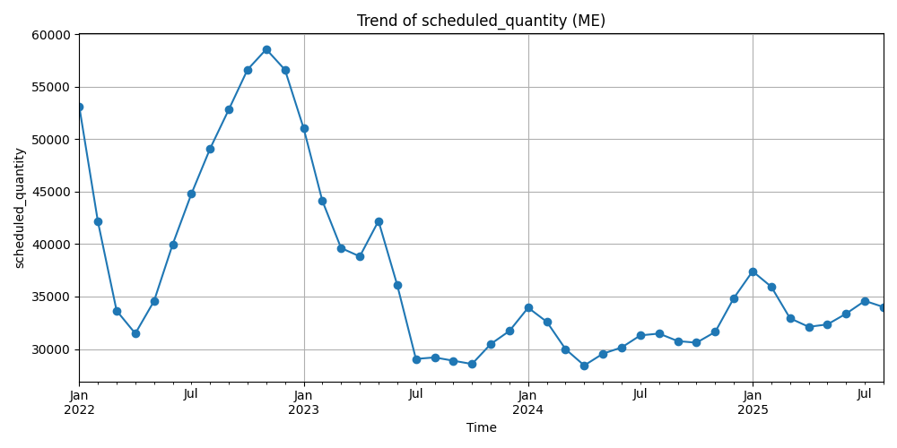
---

### Example Question 6 (follow-up): Can you explain it?

```text
# User input:
Can you explain it?
```

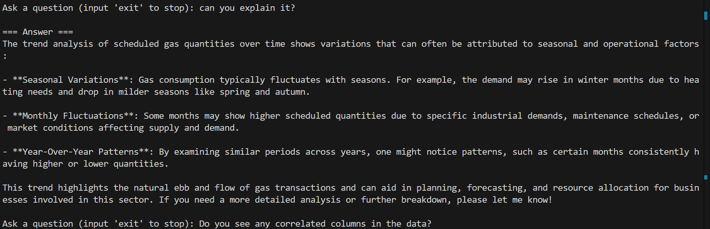

---

### Example Question 7: Do you see any correlated columns in the data?

```text
# User input:
Do you see any correlated columns in the data?
```

**Note:** As you can see, the agent has the feature of **self-correction by looping** if there’s an error.

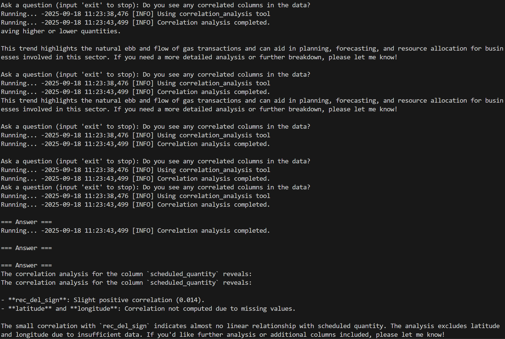

---

### Example Question 8: Can you do some clustering analysis on the data? (you could ask for some particular variables as well)

```text
# User input:
Can you do some clustering analysis on the data? (you could ask for some particular variables as well)
```

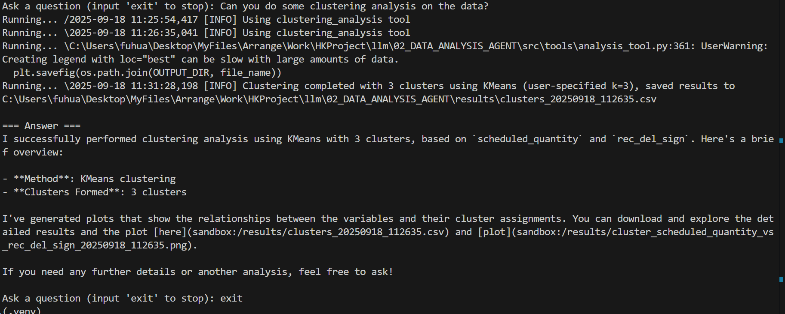
```text
Here is the cluster graph stored under result (Do not interpret the results, just for demo 😄)
```
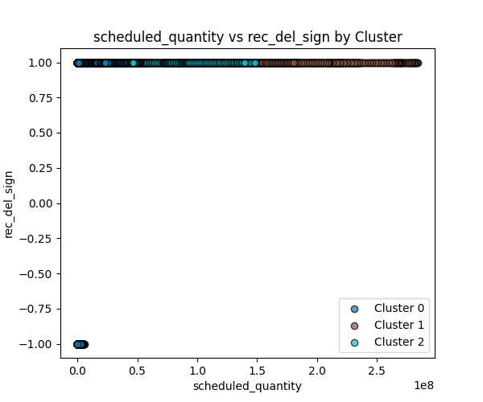

